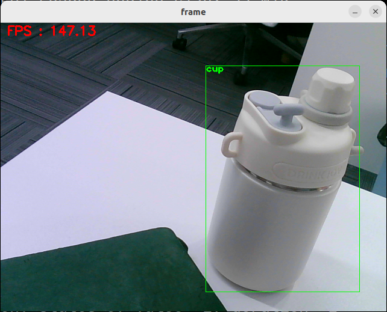
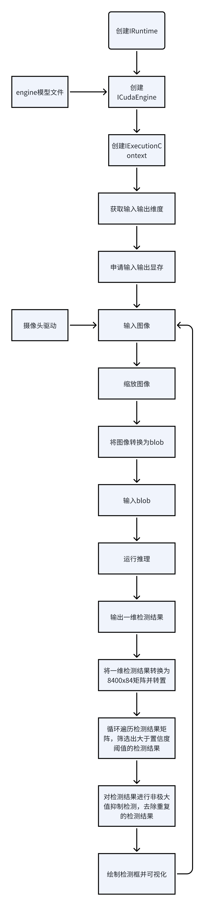

# Tool_YoloTensorRT_Jupiter

# 背景

本项目描述了如何在Ubuntu22.04系统上使用TensorRT10.8.0运行YoloV8n模型进行目标检测的功能。

# 环境确认

Yolov8n + TensorRT的使用要求

- TensorRT的C++版本
- TensorRT的Python版本
- CUDA的版本
- PyTorch的版本

这四者都要对应。检测办法如下：

TensorRT的C++版本的检测办法如下：

```shell
dpkg -l | grep TensorRT
```

输出结果为

```shell
alan@alan:~/Tools/onnxruntinmes/onnxruntime-linux-x64-gpu-1.16.0$ dpkg -l | grep TensorRT
ii  libnvinfer-bin                                     10.8.0.43-1+cuda12.8                      amd64        TensorRT binaries
ii  libnvinfer-dev                                     10.8.0.43-1+cuda12.8                      amd64        TensorRT development libraries
ii  libnvinfer-dispatch-dev                            10.8.0.43-1+cuda12.8                      amd64        TensorRT development dispatch runtime libraries
ii  libnvinfer-dispatch10                              10.8.0.43-1+cuda12.8                      amd64        TensorRT dispatch runtime library
ii  libnvinfer-headers-dev                             10.8.0.43-1+cuda12.8                      amd64        TensorRT development headers
ii  libnvinfer-headers-plugin-dev                      10.8.0.43-1+cuda12.8                      amd64        TensorRT plugin headers
ii  libnvinfer-lean-dev                                10.8.0.43-1+cuda12.8                      amd64        TensorRT lean runtime libraries
ii  libnvinfer-lean10                                  10.8.0.43-1+cuda12.8                      amd64        TensorRT lean runtime library
```

可以看到版本为10.8.0.43

TensorRT的Python版本的检测办法如下：

```shell
python3 -c "import tensorrt as trt; print(trt.__version__)"
```

输出结果如下：

```shell
10.8.0.43
```

可以看到版本为10.8.0.43

CUDA的版本的检测办法如下：

```sh
nvcc -V
```

输出为：

```sh
nvcc: NVIDIA (R) Cuda compiler driver
Copyright (c) 2005-2025 NVIDIA Corporation
Built on Wed_Jan_15_19:20:09_PST_2025
Cuda compilation tools, release 12.8, V12.8.61
Build cuda_12.8.r12.8/compiler.35404655_0
```

可以看到版本为12.8

PyTorch的版本的检测办法如下：

```sh
pip3 list | grep torch
```

输出结果如下：

```sh
alan@alan:~/Apps/YoloOnnxDemo/build$ pip3 list | grep torch
torch                                2.5.1+cu121
torchaudio                           2.5.1+cu121
torchvision                          0.20.1+cu121
vector-quantize-pytorch              1.14.46
```

到此，**我们确认TensorRT(C++)、TensorRT(Python)、CUDA、PyTorch的版本互相对应，即可环境确认完成。**

# 模型下载与转换

在如下网址下载yolov8n.pt

```tex
https://github.com/ultralytics/assets/releases/download/v0.0.0/yolov8n.pt
```

执行如下命令将yolov8n.pt转换为yolov8n.onnx

```sh
yolo mode=export model=yolov8n.pt format=onnx dynamic=True opset=12    #simplify=True
```

执行如下命令将yolov8n.onnx转换为yolov8n.engine

```sh
trtexec   --onnx=yolov8n.onnx  --saveEngine=yolov8n.engine --minShapes=images:1x3x640x640 --optShapes=images:2x3x640x640 --maxShapes=images:4x3x640x640
```

# 项目的下载与编译

执行如下命令下载项目

```sh
git clone git@github.com:AlanRuir/Tool_YoloTensorRT_Jupiter.git
```

执行如下命令编译项目

```sh
mkdir build
cd build/
cmake ..
make
```

# 项目的运行

执行如下命令运行项目

```sh
./YoloV8_Detector
```

进程会调用/dev/video0摄像头作为图像输入源，并将检测结果以方框的形式绘制在图像上并以一个新的窗口显示。



# 进程的数据流

